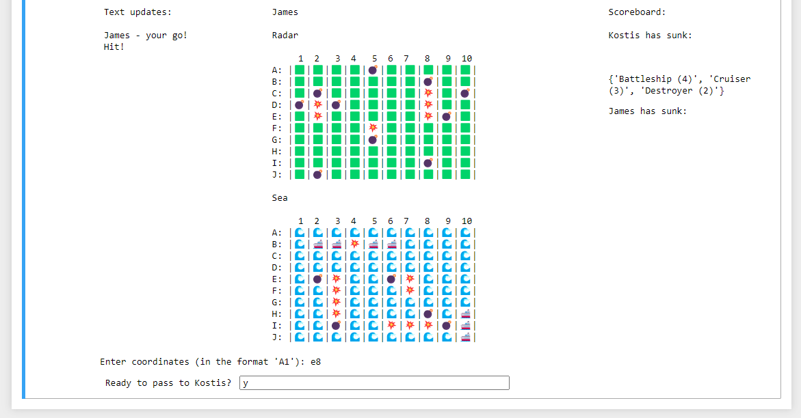
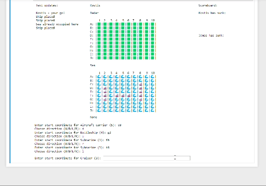
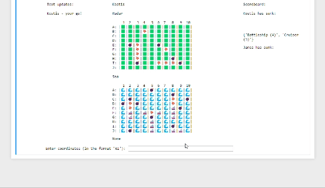
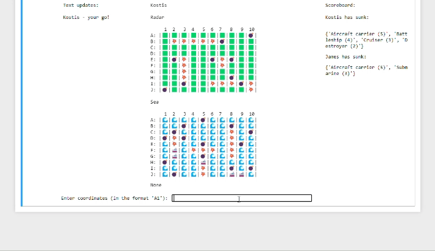

# Jupyter Battleships

This is a version of the popular game 'Battleships' in Jupyter notebook, 
 designed for two human players.

The rules for the game can be found [here](Battleships_Rules.pdf).

## Contents
1. [Gameplay](#gameplay)
   1. [Board display](#board-display)
   1. [Placement of ships](#placement-of-ships)
   1. [Taking turns](#taking-turns)
   1. [Endgame](#endgame)
2. [Pre-requisites](#pre-requisites)
3. [Testing](#testing)

## Gameplay

The notebook consists of 3 cells (*Imports*, *Functions* and *Gameplay*) - run all cells and the game will begin at the bottom of the notebook.

### Board display

As with the original board game, each player has a 'Radar' grid and a 'Sea' grid, which are displayed in the centre. 

On the left is a 'Text Updates' section, which displays the actions and results of a single turn.

On the right is a 'Scoreboard', which records any boats sunk by either player.

### Placement of ships
After entering the player names, one player is randomly assigned to start.

Ships are placed by entering a starting co-ordinate and then the direction from the co-ordinate in which the ship will be placed (Up, Down, Left or Right). The game will ensure the chosen position is on the board and does not cover any areas already occupied by other ships.

### Taking turns

Once all the ships have been placed, each player takes turns to enter a co-ordinate for their 'shot' - the 'Text Updates' section to the left of the board displays if it was a Hit or a Miss and the player's radar will be updated.

To maintain secrecy between turns, each player is asked to confirm they are ready at the end of their turn - once they have confirmed, the board display is cleared so they computer can be turned or passed without revealing either players' positions to each other.

### Endgame

Any boats sunk are tracked on the scoreboard on the right of the screen.

When one player has sunk all 5 of the other player's boats, a congratulations message appears below the boards and players are asked if they want to play again.

## Pre-requisites
- Python 3.x
- IPython 8.15+
- ipywidgets 8.0.4+
- getpass 
- sys

## Testing

During development, to facilitate testing of the game's functionality towards the endgame we included a 'test_variables()' function. When player 1 is given the name 'test', the board is automatically set with all ships placed and with only one co-ordinate not hit for each of the test players ships.  

We hope to have caught all behavioural bugs, but please let us know if you find any!